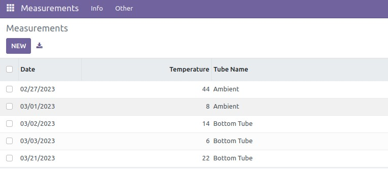
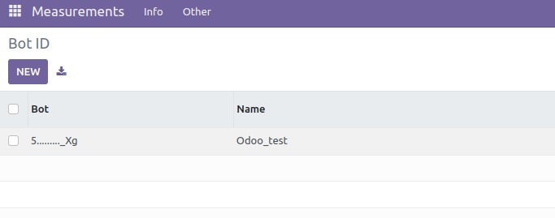
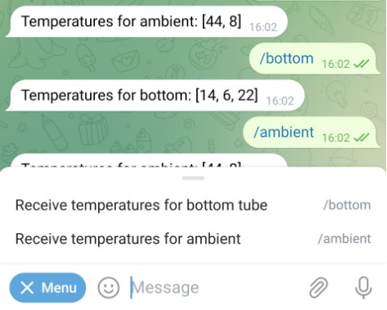

# **Overview**

In this repo, there is an implementation of a Telegram Bot with several comands which retrieve data from a DB using Odoo models.

The code of the module is [here](https://github.com/juleek/odoo_task/tree/master/telegram).

The telegram module consists of two models:

* **The "measurements" model** - stores:
    * name of temperature sensors
    * for each sensor: temperature by date





* **The "telegram_bot" model** stores information about bot:
    * bot id
    * bot name





### **Installation Steps**:

* Create a bot in Telegram;
* Telegram want to use SSL/HTTPS, so we needed to create an TLS termination proxy:
    * Create SSL self-signed certificate and key: `openssl req -newkey rsa:2048 -sha256 -nodes -keyout ~/odoo_keys/key.pem -x509 -days 365 -out ~/odoo_keys/cert.pem -subj "/C=NG/ST=Lagos/L=Lagos/O=YOUR_ORG_NAME_HERE/CN=34.89.73.XXX"`
    * I chose Nginx: `sudo apt-get install nginx`
    * Set it up in such a way that it listens on port 443 and forwards requests to Odoo port 8069
* Once we have an https end-point, setup webhook for Telegram:

    ```
    curl -F "url=https://34.89.73.XXX:443/odoo" -F "certificate=@/.../odoo_keys/cert.pem" https://api.telegram.org/bot{bot_id}/setWebhook
    ```

* Create 2 commands in Telegram: `ambient` and `bottom`.

* Start odoo:

    ```bash
    ./odoo-bin --addons-path=$HOME/.../odoo_task,addons -d rd-demo -u telegram --data-dir $HOME/.../odoo_data_dir --proxy-mode
    ```


Here is how it looks in Telegram:


